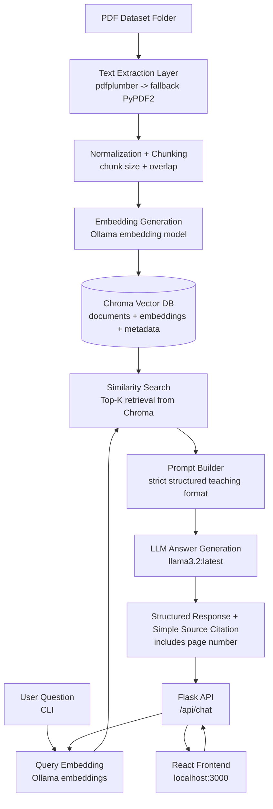

# BIO stat AI

BIO stat AI is a local Retrieval-Augmented Generation (RAG) assistant for medical and biostatistics PDFs. It extracts PDF text, creates semantic chunks, stores embeddings in a vector database, and answers user questions with source-backed responses using local Ollama models.

## Key Features

- Local-first pipeline (no cloud dependency required for inference/search)
- Multi-PDF ingestion with page-level metadata
- Semantic retrieval using embeddings + Chroma vector database
- Structured educational responses (Concept, Explanation, Key Points, Example, Final Summary)
- Transparent source display with page number
- CLI chat and ChatGPT-style React web UI

## Tech Stack

- Python 3.10+
- Ollama (`llama3.2:latest` for answering, `nomic-embed-text` for embeddings by default)
- ChromaDB (persistent vector store)
- `pdfplumber` with `PyPDF2` fallback for extraction
- Flask API backend
- React frontend (ChatGPT-like chat UI)

## Project Structure

```text
ChatBot/
├─ PDF Dataset/              # Input PDF files
├─ chroma_db/                # Persistent vector DB (generated)
├─ rag/
│  ├─ config.py              # Environment-driven config
│  ├─ pdf_extract.py         # PDF extraction
│  ├─ chunking.py            # Chunk generation
│  ├─ ollama_client.py       # Ollama API wrapper
│  ├─ vectorstore.py         # Chroma operations
│  ├─ ingest.py              # Ingestion pipeline
│  └─ qa.py                  # Retrieval + prompt orchestration
├─ ingest.py                 # Ingestion entrypoint
├─ chat.py                   # CLI chatbot
├─ app.py                    # Flask API server
├─ frontend/                 # React web client (HTML/CSS/JS via React)
└─ requirements.txt
```

## End-to-End Architecture



## How It Works

### 1) Offline Indexing (Ingestion)

1. Load each PDF from `PDF Dataset/`
2. Extract text page-by-page
3. Split page text into overlapping chunks
4. Generate embeddings for chunk batches
5. Store text, embedding, and metadata (`source`, `page`, `chunk_index`) in Chroma

Run:

```bash
python ingest.py
```

### 2) Online Question Answering

1. Convert user question into an embedding
2. Retrieve most similar chunks from Chroma
3. Build a strict, context-only structured prompt
4. Generate answer with `llama3.2:latest`
5. Show concise source citation with page number

CLI:

```bash
python chat.py
```

Flask API server:

```bash
python app.py
```

React frontend:

```bash
cd frontend
npm install
npm start
```

## Setup

```bash
python -m venv .venv
.venv\Scripts\python -m pip install -r requirements.txt
```

Install frontend dependencies:

```bash
cd frontend
npm install
```

## Run (Recommended)

Terminal 1 (backend API):

```bash
python app.py
```

Terminal 2 (frontend UI):

```bash
cd frontend
npm start
```

Open:

- Frontend: `http://localhost:3000`
- Backend health check: `http://localhost:5000/api/health`

## Configuration

Environment variables:

- `PDF_DIR` (default: `PDF Dataset`)
- `CHROMA_DIR` (default: `chroma_db`)
- `CHROMA_COLLECTION` (default: `pdf_chunks`)
- `OLLAMA_HOST` (default: `http://localhost:11434`)
- `CHAT_MODEL` (default: `llama3.2:latest`)
- `EMBED_MODEL` (default: `nomic-embed-text`)
- `CHUNK_SIZE` (default: `1100`)
- `CHUNK_OVERLAP` (default: `150`)

## Model Behavior and Safety

- Uses only retrieved context for answering
- Includes fallback when context is insufficient:
  - `Sorry, this is not available in the provided material.`
- Forces structured educational output for beginner-friendly learning

## Repository

GitHub: [DineshTechCrafts/Biostat-AI-Chatbot-using-LLM-and-RAG](https://github.com/DineshTechCrafts/Biostat-AI-Chatbot-using-LLM-and-RAG.git)

